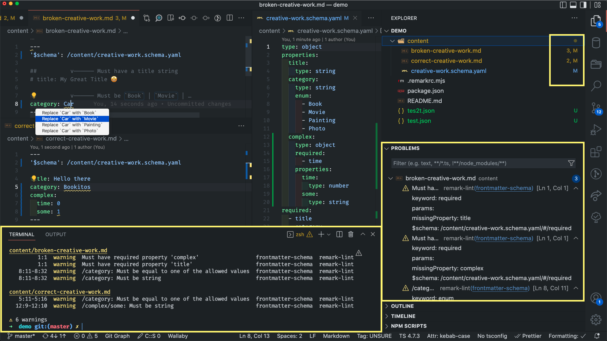

# `remark-lint-frontmatter-schema`

<!-- [](https://github.com/@julian_cataldo/remark-lint-frontmatter-schema/actions/workflows/release.yml?query=branch%3Amain) -->

[](https://www.npmjs.com/package/@julian_cataldo/remark-lint-frontmatter-schema)
[](https://makeapullrequest.com)
[](./LICENSE)
[](https://www.npmjs.com/package/@julian_cataldo/remark-lint-frontmatter-schema)

Validate **Markdown** frontmatter **YAML** against an associated **JSON schema** with this **remark-lint** rule plugin.

Features types validation, pattern, enumerations with auto-fixable with suggestions, proper code range mapping for IDE underlining squiggles…

---

- [`remark-lint-frontmatter-schema`](#remark-lint-frontmatter-schema)
- [Demo](#demo)
- [Quick start](#quick-start)
  - [Installation](#installation)
    - [VS Code (optional)](#vs-code-optional)
  - [Setting up](#setting-up)
    - [Workspace](#workspace)
    - [Markdown content](#markdown-content)
    - [CLI / IDE (VS Code)](#cli--ide-vs-code)
    - [MD / MDX pipeline](#md--mdx-pipeline)
      - [Custom](#custom)
      - [Framework](#framework)
        - [Astro](#astro)
        - [Gatsby](#gatsby)

---

# Demo

[](./docs/screenshot.png)

# Quick start

## Installation

```shell
pnpm install -D \
remark remark-cli \
remark-frontmatter \
@julian_cataldo/remark-lint-frontmatter-schema
```

> **Remove** `-D` flag if you're using this plugin within a runtime **`unified`** MD / MDX **pipeline** (Custom, Astro, Gatsby, etc.), for production.  
> **Keep it** if you just want to lint with **CLI** or your **IDE** locally, without any production / CI needs.

### VS Code (optional)

```
code --install-extension unifiedjs.vscode-remark
```

## Setting up

Supporting `remark-cli` or `unifiedjs.vscode-remark` extension.

👉  **See [./demo](./demo/)** folder to get a working, pre-configured, bare project workspace.  
You also get example markdown files and associated schema to play with.

📌  Checkout the **[demo/README.md](./demo) for step-by-step instructions**.

### Workspace

Create root config file for `remark-cli`:  
`touch ./.remarkrc.mjs`

Paste this base config:

```mjs
import remarkFrontmatter from 'remark-frontmatter';
import rlFmSchema from '@julian_cataldo/remark-lint-frontmatter-schema';

const remarkConfig = {
  plugins: [remarkFrontmatter, rlFmSchema],
};
export default remarkConfig;
```

### Markdown content

See **[./demo/content](./demo/content)** files for examples.

Schema association is done relative to project root, thanks to `'$schema'` key:

```markdown
---
'$schema': /content/creative-work.schema.yaml

title: Hello there
category: Book
---

# You're welcome!

…
```

`creative-work.schema.yaml`

```yaml
type: object
properties:
  title:
    type: string
# ...
```

### CLI / IDE (VS Code)

Linting whole workspace `**/*.md` files with `remark-cli`:

```sh
pnpm remark .
```

Yields:

```shell
# ...
content/correct-creative-work.md
  1:1  warning  /category: Must be equal to one of the allowed values  frontmatter-schema  remark-lint
  1:1  warning  /complex/some: Must be string                          frontmatter-schema  remark-lint

⚠ 6 warnings
```

### MD / MDX pipeline

Use it as usual like any remark plugin inside your framework or your custom `unified` pipeline.

#### Custom

```ts
// ...
import remarkFrontmatter from 'remark-frontmatter';
import rlFmSchema from '@julian_cataldo/remark-lint-frontmatter-schema';

// ...
unified()
  //...
  .use(remarkFrontmatter)
  .use(rlFmSchema);
// ...
```

#### Framework

> **Warning**  
> NOT tested yet!

##### Astro

In `astro.config.mjs`

```ts
// ...
export default defineConfig({
  // ...
  remarkPlugins: [
    // ...
    'remark-frontmatter',
    '@julian_cataldo/remark-lint-frontmatter-schema',
    // ...
  ];
  // ...
});
```

##### Gatsby

In `gatsby-config.js`

```ts
{
  // ...
  plugins: [
    // ...
    {
      resolve: 'gatsby-transformer-remark',
      options: {
        plugins: [
          // ...
          'remark-frontmatter',
          '@julian_cataldo/remark-lint-frontmatter-schema',
          // ...
        ],
      },
    },
    // ...
  ];
}
```

<!-- OBSOLETE -->
<!-- # Known limitations

Actually, you will not have **code range detection** for schemas errors.
Finding a way of doing this would easily allow hot-fix replacement for `enum` suggestions, for example.
The great folks who made [yaml-language-server](https://github.com/redhat-developer/yaml-language-server)
have tackled this, and much more.
In fact, this remark plugin is **very far** from `yaml-language-server` capabilities, which are astonishing.
Still, this `remark` plugin is, I think, the only way to validate YAML
frontmatter inside Markdown.
My current knowledge is that YAML in Markdown, by not being part of any official specs, is hindering development in this direction.
So it's better than nothing I guess, and could be a first step for something more robust. -->

---

Using:

- **CLI Tool**
  > Remark lint | https://github.com/remarkjs/remark-lint
- **IDE Extension** (optional)
  > VS Code `unifiedjs.vscode-remark`  
  > https://github.com/remarkjs/vscode-remark

Major dependencies:

`ajv`, `yaml`, `remark`, `remark-frontmatter`, `unified`, `remark-cli`

---

🔗  [JulianCataldo.com](https://www.juliancataldo.com)
