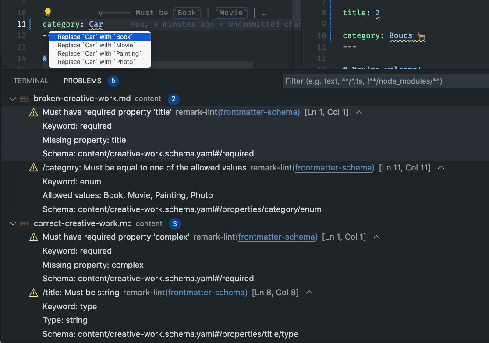
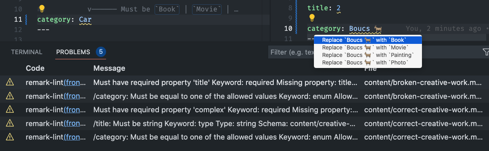

# `remark-lint-frontmatter-schema`

<!-- [](https://github.com/@julian_cataldo/remark-lint-frontmatter-schema/actions/workflows/release.yml?query=branch%3Amain) -->

[](https://www.npmjs.com/package/@julian_cataldo/remark-lint-frontmatter-schema)
[](./LICENSE)
[](https://www.npmjs.com/package/@julian_cataldo/remark-lint-frontmatter-schema)  
[](https://code.visualstudio.com)
[](https://unifiedjs.com)  
[](http://www.typescriptlang.org/)
[](https://prettier.io)
[](https://editorconfig.org)
[](https://eslint.org)
[](https://app.renovatebot.com/dashboard)
[](https://makeapullrequest.com)

Validate **Markdown** frontmatter **YAML** against an associated **JSON schema** with this **remark-lint** rule plugin.

Supports:

- **Types validation**, pattern, enumerations,… and all you can get with JSON Schema
- **Code location** problems indicator (for IDE to underline)
- **Auto-fixes** with suggestions
- **C**ommand **L**ine **I**nterface reporting
- **VS Code** integration (see below)
- **Global patterns** or **in-file** schemas associations
- In JS framework **MD / MDX pipelines**

# Demo

[](https://raw.githubusercontent.com/JulianCataldo/remark-lint-frontmatter-schema/master/docs/screenshot.png)

---

[](https://raw.githubusercontent.com/JulianCataldo/remark-lint-frontmatter-schema/master/docs/screenshot-2.png)

---

[](https://raw.githubusercontent.com/JulianCataldo/remark-lint-frontmatter-schema/master/docs/screenshot-3.png)

## 👉  **Play with pre-configured [./demo](./demo/)**

Quick shallow **clone** with:

```sh
pnpx degit JulianCataldo/remark-lint-frontmatter-schema/demo ./demo
```

---

**Jump to**:

- [`remark-lint-frontmatter-schema`](#remark-lint-frontmatter-schema)
- [Demo](#demo)
  - [👉  **Play with pre-configured ./demo**](#play-with-pre-configured-demo)
- [Quick start](#quick-start)
  - [Installation](#installation)
    - [VS Code (optional)](#vs-code-optional)
  - [Configuration](#configuration)
    - [CLI / IDE (VS Code) — **Static** linting](#cli--ide-vs-code--static-linting)
      - [Workspace](#workspace)
      - [Schema example](#schema-example)
      - [Schemas associations](#schemas-associations)
        - [Inside frontmatter](#inside-frontmatter)
        - [🆕  Globally, with patterns](#globally-with-patterns)
      - [CLI usage](#cli-usage)
    - [MD / MDX pipeline — **Runtime** validation](#md--mdx-pipeline--runtime-validation)
      - [🆕  Custom pipeline](#custom-pipeline)
        - [Implementation living example](#implementation-living-example)
        - [Important foot-notes for custom pipeline](#important-foot-notes-for-custom-pipeline)
      - [Framework](#framework)
        - [Astro](#astro)
        - [Gatsby](#gatsby)
  - [Interface](#interface)
  - [Footnotes](#footnotes)

---

# Quick start

## Installation

```sh
pnpm install -D \
remark remark-cli \
remark-frontmatter \
@julian_cataldo/remark-lint-frontmatter-schema
```

> **Remove** `-D` flag for runtime **`unified`** MD / MDX **pipeline** (custom, Astro, Gatsby, etc.), for production.  
> **Keep it** if you just want to lint with **CLI** or your **IDE** locally, without any production / CI needs.

### VS Code (optional)

```sh
code --install-extension unifiedjs.vscode-remark
```

## Configuration

### CLI / IDE (VS Code) — **Static** linting

👉  **See [./demo](./demo/)** folder to get a working, pre-configured, bare project workspace.  
You also get example markdown files and associated schema to play with.  
Supports `remark-cli` and/or `unifiedjs.vscode-remark` extension.

📌  Check out the **[demo/README.md](./demo) for bootstrapping** it.

#### Workspace

Create root config file for `remark` to source from:  
`touch ./.remarkrc.mjs`

Paste this base config:

```mjs
import remarkFrontmatter from 'remark-frontmatter';
import rlFmSchema from '@julian_cataldo/remark-lint-frontmatter-schema';

const remarkConfig = {
  plugins: [remarkFrontmatter, rlFmSchema],
};
export default remarkConfig;
```

#### Schema example

`./content/creative-work.schema.yaml`

```yaml
type: object
properties:
  title:
    type: string
# …
```

#### Schemas associations

Inspired by [VS Code JSON Schema](https://code.visualstudio.com/docs/languages/json#_json-schemas-and-settings)
and [`redhat.vscode-yaml`](https://marketplace.visualstudio.com/items?itemName=redhat.vscode-yaml) conventions.

##### Inside frontmatter

See **[./demo/content](./demo/content)** files for examples.

Schema association can be done directly **inside** the **frontmatter** of the **markdown** file,
relative to project root, thanks to the `'$schema'` key:

```markdown
---
'$schema': /content/creative-work.schema.yaml

title: Hello there
category: Book
# …
---

# You're welcome!

🌝  My **markdown** content…  🌚
…
```

##### 🆕  Globally, with patterns

> **Note**:  
> Locally defined **`'$schema'` takes precedence** over global settings below.

```js
const remarkConfig = {
  plugins: [
    remarkFrontmatter,
    [
      rlFmSchema,
      {
        schemas: {
          /* One schema for many files */
          './content/creative-work.schema.yaml': [
            /* Support glob patterns */
            './content/*-creative-work.md',
            /* Or direct file association */
            './content/the-one.md',
          ],
          './content/ghost.schema.yaml': [
            './content/casper.md',
            './content/ether.md',
          ],
        },
      },
    ],
  ],
};
```

`'./foo'`, `'/foo'`, `'foo'`, all will work.  
It's always relative to your `./.remarkrc.mjs` file, in your workspace root.

#### CLI usage

Linting whole workspace files (as `./**/*.md`) with `remark-cli`:

```sh
pnpm remark .
```

Yields:

```sh
# …
content/correct-creative-work.md
  1:1  warning  /category: Must be equal to one of the allowed values  frontmatter-schema  remark-lint
  1:1  warning  /complex/some: Must be string                          frontmatter-schema  remark-lint

⚠ 6 warnings
```

### MD / MDX pipeline — **Runtime** validation

Use it as usual like any remark plugin inside your framework or your custom `unified` pipeline.

#### 🆕  Custom pipeline

When processing markdown as single files inside your JS/TS app.

Schema should be provided programmatically like this:

```ts
// …
import remarkFrontmatter from 'remark-frontmatter';
import rlFmSchema from '@julian_cataldo/remark-lint-frontmatter-schema';
import type { JSONSchema7 } from 'json-schema';
import { reporter } from 'vfile-reporter';

const mySchema: JSONSchema7 = {
  /* … */
};

const output = await unified()
  // Your pipeline (basic example)
  .use(remarkParse)
  // …
  .use(remarkFrontmatter)

  .use(rlFmSchema, {
    /* Bring your own schema */
    embed: mySchema,
  })

  // …
  .use(remarkRehype)
  .use(rehypeStringify)
  .use(rehypeFormat)
  .process(theRawMarkdownLiteral);

/* `path` is for debugging purpose here, as MD literal comes from your app. */
output.path = './the-current-processed-md-file.md';

console.error(reporter([output]));
```

Yields:

```
./the-current-processed-md-file.md
  1:1  warning  Must have required property 'tag'  frontmatter-schema  remark-lint

⚠ 1 warning
```

##### Implementation living example

Checkout [**Astro Content**](https://github.com/JulianCataldo/astro-content) repository.

<!-- It's a text based, structured content assistant, integrated in Astro, for edition and consumption.   -->
<!-- file or API based  -->

Astro Content relies on this library, among others, for providing linting reports.

<!-- You can see **remark-lint-frontmatter-schema** in action, on **[this line, in Astro Content source](outdated)**. -->

##### Important foot-notes for custom pipeline

This is **different from static linting**, with VS Code extension or CLI.  
It **will not source `.remarkrc`** (but you can source it by your own means, if you want).  
In fact, it's not aware of your file structure,
nor it will associate or import any schema / markdown files.  
That way, it will integrate easier with your own business logic and existing pipelines.  
I found that **static linting** (during editing) / and **runtime validation** are two different
uses cases enough to separate them in their setups, but I might converge them partially.

#### Framework

> **Warning**  
> WIP. **NOT tested yet**!

See [global patterns `schemas` associations](#globally-with-patterns) for settings reference.

##### Astro

In `astro.config.mjs`

```ts
// …
export default defineConfig({
  // …
  remarkPlugins: [
    // …
    'remark-frontmatter',
    ['@julian_cataldo/remark-lint-frontmatter-schema', { schemas }],
    // …
  ];
  // …
});
```

##### Gatsby

In `gatsby-config.js`

```ts
{
  // …
  plugins: [
    // …
    {
      resolve: 'gatsby-transformer-remark',
      options: {
        plugins: [
          // …
          'remark-frontmatter',
          ['@julian_cataldo/remark-lint-frontmatter-schema', { schemas }],
          // …
        ],
      },
    },
    // …
  ];
}
```

## Interface

```ts
export interface Settings {
  /**
   * Global workspace file associations mapping (for linter extension).
   *
   * Example: `'schemas/thing.schema.yaml': ['content/things/*.md']`
   */
  schemas?: Record<string, string[]>;
  /**
   * Direct schema embedding (for using inside an `unified` transform pipeline).
   *
   * Format: JSON Schema - draft-2019-09
   *
   * **Documentation**: https://ajv.js.org/json-schema.html#draft-07
   */
  embed?: JSONSchema7;
  /**
   * **Documentation**: https://ajv.js.org/options.html
   */
  ajvOptions?: AjvOptions;
}

export interface FrontmatterSchemaMessage extends VFileMessage {
  schema: AjvErrorObject & { url: JSONSchemaReference };
}
```

Example of a `VFileMessage` content you could collect from this lint rule:

```jsonc
[
  // …
  {
    // JS native `Error`
    "name": "Markdown YAML frontmatter error (JSON Schema)",
    "message": "/clientType: Must be equal to one of the allowed values",

    // `VFileMessage` (Linter / VS Code…)
    "reason": "/clientType: Must be equal to one of the allowed values",
    "line": 16,
    "column": 13,
    "url": "https://github.com/JulianCataldo/remark-lint-frontmatter-schema",
    "source": "remark-lint",
    "ruleId": "frontmatter-schema",
    "position": {
      "start": {
        "line": 16,
        "column": 13
      },
      "end": {
        "line": 16,
        "column": 24
      }
    },
    "fatal": false,
    "actual": "Individuaaaaaaaal",
    "expected": ["Corporate", "Non-profit", "Individual"],

    // Condensed string, human readable version of AJV error object
    "note": "Keyword: enum\nAllowed values: Corporate, Non-profit, Individual\nSchema path: #/properties/clientType/enum",

    // AJV's `ErrorObject`
    "schema": {
      "url": "https://ajv.js.org/json-schema.html",
      "instancePath": "/clientType",
      "schemaPath": "#/properties/clientType/enum",
      "keyword": "enum",
      "params": {
        "allowedValues": ["Corporate", "Non-profit", "Individual"]
      },
      "message": "must be equal to one of the allowed values"
    }
  }
]
```

<!-- OBSOLETE -->
<!-- # Known limitations

Actually, you will not have **code range detection** for schemas errors.
Finding a way of doing this would easily allow hot-fix replacement for `enum` suggestions, for example.
The great folks who made [yaml-language-server](https://github.com/redhat-developer/yaml-language-server)
have tackled this, and much more.
In fact, this remark plugin is **very far** from `yaml-language-server` capabilities, which are astonishing.
Still, this `remark` plugin is, I think, the only way to validate YAML
frontmatter inside Markdown.
My current knowledge is that YAML in Markdown, by not being part of any official specs, is hindering development in this direction.
So it's better than nothing I guess, and could be a first step for something more robust. -->

---

## Footnotes

**100% ESM**, including dependencies.

Using:

- **CLI Tool**
  > Remark lint | https://github.com/remarkjs/remark-lint
- **IDE Extension** (optional)
  > VS Code `unifiedjs.vscode-remark`  
  > https://github.com/remarkjs/vscode-remark

Major dependencies:

`ajv`, `yaml`, `remark`, `remark-frontmatter`, `unified`, `remark-cli`

---

See [CHANGELOG.md](./CHANGELOG.md) for release history.

---

🔗  [JulianCataldo.com](https://www.juliancataldo.com)
